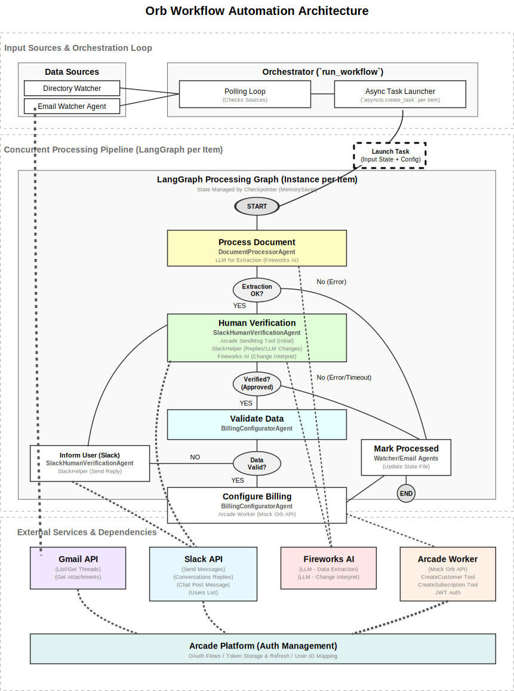

# Orb Workflow Automation with LangGraph and Arcade

## Project Overview

This project implements an automated workflow to process incoming documents and emails containing potential customer subscription information, extract key details, verify them with human input via Slack, and finally configure billing using a mock Orb API (simulated via Arcade Worker tools). The core goal is to create a robust, concurrent pipeline that handles multiple data sources and incorporates a reliable human-in-the-loop verification step before committing changes to the billing system.

**Core Technologies:**

*   **Python:** Primary programming language.
*   **LangGraph:** Used for orchestrating the multi-step processing pipeline for each document/email. Enables state management, conditional logic, and agentic steps.
*   **Arcade:** Leveraged for:
    *   **Authentication:** Securely managing OAuth flows and tokens for Google (Gmail) and Slack, abstracting complexity from the agent logic.
    *   **Standard Tools:** Utilizing pre-built Arcade tools where applicable (e.g., `Google.ListEmails`, `Google.GetThread`, `Slack.SendMessageToChannel` for initial posts).
    *   **Worker Tools:** Interacting with a local Arcade Worker hosting custom Orb API simulation tools (`CreateCustomer`, `CreateSubscription`).
*   **Custom Helper Classes (`custom_tools/`):** Python classes developed to bridge functionality gaps in standard Arcade toolkits (Gmail attachments, Slack threaded replies) while still utilizing Arcade for authentication token management.
*   **LLMs (via Fireworks AI):** Used for data extraction from documents/emails and interpreting user change requests during Slack verification.
*   **Poetry:** For dependency management.
*   **Asyncio:** For enabling concurrent processing of multiple documents/emails.

## Architecture and Workflow

The system operates based on a main asynchronous loop that discovers new items and launches independent processing pipelines (LangGraph graphs) for each item.

**1. Discovery Loop (`langgraph_orchestrator.py:run_workflow`):**
    *   Continuously monitors a local `documents` directory using `DocumentWatcherAgent`.
    *   Periodically checks a specified Gmail inbox for relevant emails using `EmailWatcherAgent`.
        *   Uses Arcade `Google.ListEmails` for initial filtering.
        *   Uses Arcade `Google.GetThread` for fetching full email content.
        *   Leverages the custom `GmailAttachmentTools` helper (using Arcade auth + `googleapiclient`) to download attachments, as standard Arcade tools lacked this.
    *   Auto-Rate-limits email checks (e.g., every 60 seconds).

**2. Concurrent Task Launching:**
    *   When a new file or email is detected and processed into a source document path, the main loop generates a unique `thread_id` for this item.
    *   It constructs an initial `input_state` dictionary containing the `document_path` and `source`.
    *   It launches the LangGraph processing pipeline (`graph.astream`) for this item as a separate, non-blocking `asyncio` task (`asyncio.create_task`).
    *   The main loop immediately continues polling for new items, allowing multiple processing pipelines to run concurrently.

**3. LangGraph Processing Pipeline (`langgraph_orchestrator.py:build_processing_graph`):**
    *   Each pipeline instance maintains its own state, persisted via LangGraph's `MemorySaver` checkpointer, keyed by the unique `thread_id`.
    *   **Entry Point:** `process_document`
    *   **Nodes:**
        *   `process_document`: (Uses `DocumentProcessorAgent`) Reads the document/attachment content. Calls an LLM (Fireworks AI) to extract structured data (customer name, email, plan, seats, addons). Updates state with `extracted_data`.
        *   `human_verification`: (Uses `SlackHumanVerificationAgent`)
            *   Sends `extracted_data` to a configured Slack channel using Arcade `Slack.SendMessageToChannel` for the initial message. Stores the message `ts` and `channel_id` in the state.
            *   Enters a loop waiting for user replies *in the thread* using the custom `SlackHelper` (`get_thread_replies` method, which uses Arcade auth + `slack_sdk`'s `conversations.replies`).
            *   Processes replies: Checks for approval keywords. If not approved, uses LLM to interpret change requests against the *current* data state.
            *   If changes are made by the LLM, sends the updated data back to the *same Slack thread* using `SlackHelper` (`send_reply_in_thread` method) and waits for further replies (loops within the agent).
            *   If the user request is unclear, sends a clarification message to the thread (using `SlackHelper`) and waits again.
            *   Continues until explicit approval is received or retries/timeout are exceeded.
            *   On success, updates state with `verified_data`, `is_verified=True`. On failure/timeout, sets `is_verified=False` and `status='error'`.
        *   `validate_data_for_billing`: (Uses `BillingConfiguratorAgent.validate_data`) Checks if the `verified_data` contains the required fields (customer name, email, mappable plan type). Sets `is_valid_for_billing` and `validation_error` in the state.
        *   `inform_user_of_validation_error`: (Conditional) If validation fails (`is_valid_for_billing == False`), sends a message detailing the missing fields back to the original Slack thread using `SlackHelper`. Resets state (`is_verified=None`, `verified_data=None`, etc.) to loop back to `human_verification`.
        *   `configure_billing`: (Conditional) If validation passes (`is_valid_for_billing == True`), uses `BillingConfiguratorAgent` to:
            *   Map plan names to IDs.
            *   Call the custom Arcade Worker tools `CreateCustomer` and `CreateSubscription` (simulating Orb API calls) using the `verified_data`.
            *   Updates state with `customer_id`, `subscription_id`, and sets `status='success'` or `status='error'`.
        *   `mark_document_processed`: (Uses `DocumentWatcherAgent` / `EmailWatcherAgent`) Marks the original file or email ID as processed based on the `source` in the state. This prevents reprocessing. Returns `{"status": "completed"}` to satisfy LangGraph state update requirement before ending.
    *   **Edges:** Conditional logic routes the flow based on node outcomes (e.g., extraction success, verification success, validation success, billing success/failure). Includes the loop from validation failure back to human verification.

## Architecture Diagram



## Components Breakdown

*   **Agents (`orb-workflow/agents/`):**
    *   `DocumentWatcherAgent`: Monitors the `documents` directory for new files.
    *   `EmailWatcherAgent`: Polls Gmail for relevant emails, uses `GmailAttachmentTools` for attachments.
    *   `DocumentProcessorAgent`: Handles LLM-based data extraction from text/PDF content.
    *   `SlackHumanVerificationAgent`: Orchestrates the multi-turn Slack interaction for verification, utilizing `SlackHelper`.
    *   `BillingConfiguratorAgent`: Validates data and interacts with the mock Orb API (via Arcade Worker tools) to create customers/subscriptions.
*   **Custom Tools/Helpers (`orb-workflow/custom_tools/`):**
    *   `GmailAttachmentTools`: Local Python class providing `list_message_attachments` and `get_gmail_attachment`. Uses Arcade Auth + `googleapiclient`. (See `custom_tools/README.md`).
    *   `SlackHelper`: Local Python class providing `get_thread_replies` and `send_reply_in_thread`. Uses Arcade Auth + `slack_sdk`. (See `custom_tools/README.md`).
*   **Orchestrator (`orb-workflow/langgraph_orchestrator.py`):**
    *   Contains the main `run_workflow` async loop.
    *   Defines the `WorkflowState` TypedDict.
    *   Builds the processing pipeline graph using `LangGraph`.
    *   Handles concurrent task launching using `asyncio`.
*   **Arcade Worker (`arcade/orb_toolkit/`):**
    *   Contains the formal Arcade tools (`CreateCustomer`, `CreateSubscription`) that simulate the Orb API endpoints. Requires separate execution (`arcade-worker run`).

## Setup and Installation

1.  **Prerequisites:** Python 3.11+, Poetry.
2.  **Clone Repository:** Clone this project.
3.  **Install Dependencies:** Navigate to the `orb-workflow` directory and run:
    ```bash
    poetry install
    ```
4.  **Environment Variables:** Create a `.env` file in the `orb-workflow` directory with the following (replace placeholders):
    ```dotenv
    # LLM Provider
    FIREWORKS_API_KEY="fw_..."

    # Arcade Settings
    ARCADE_API_KEY="arc_..."
    ARCADE_WORKER_SECRET="dev" # Must match worker.toml if running local worker

    # Gmail Watcher Settings
    TEST_EMAIL_ADDRESS="your_monitored_email@gmail.com" # Email to check

    # Slack Verifier Settings
    SLACK_USER_ID="your_arcade_slack_auth_user" # Slack user ID Arcade uses for auth flow
    SLACK_VERIFICATION_CHANNEL="your-verification-channel-name" # Slack channel name
    # SLACK_BOT_USER_ID="Uxxxxxxx" # Optional: Bot's own Slack User ID to ignore its messages

    # Orb API (Worker) Settings
    # ORB_API_URL="http://127.0.0.1:8002" # Default if running worker locally
    ```
5.  **Arcade Worker (Mock Orb API):**
    *   Navigate to the `arcade/orb_toolkit` directory.
    *   Ensure the `worker.toml` file exists and is configured (especially the `secret`).
    *   Run the worker in a separate terminal: `arcade-worker run` (or however your Arcade worker is hosted). Ensure the `ORB_API_URL` in `.env` points to this worker if not running on the default port.

## Running the Workflow

1.  Ensure the Arcade Worker (Mock Orb API) is running.
2.  Navigate to the `orb-workflow` directory.
3.  Run the orchestrator:
    ```bash
    poetry run python langgraph_orchestrator.py
    ```
4.  The orchestrator will start polling the `documents` directory and checking the specified Gmail account.
5.  Add text or PDF files to the `documents` directory or send emails containing invoice-like data (with optional attachments) to the monitored email address.
6.  Monitor the logs and the specified Slack channel (`#orb-verify-invoice` by default) for verification requests. Interact with the Slack bot **in the thread** to approve or request changes.

## Key Challenges Encountered & Solutions

This project involved navigating several technical hurdles, primarily around local development setup, tool functionality gaps, direct worker interactions, and asynchronous orchestration:

1.  **Local Arcade Worker JWT Authentication:**
    *   **Challenge:** Setting up the local Arcade Worker (`arcade/orb_toolkit`) for testing the `BillingConfiguratorAgent` required correctly formatted JWTs for the simulated Orb API authentication. The documentation or default setup didn't immediately clarify the expected JWT structure (`sub`, `aud` fields specifically).
    *   **Solution:** We had to inspect the Arcade Worker's internal authentication logic (specifically referencing `worker/core/auth.py` from the Arcade source) to understand the requirements. We then implemented the `_generate_jwt` method within the `BillingConfiguratorAgent` to create compliant tokens for local testing.

2.  **Gmail Attachment Handling:**
    *   **Challenge:** The standard Arcade `Google` toolkit, while effective for listing/reading emails, lacked functions to directly access or download attachments, which was crucial for processing PDF invoices received via email.
    *   **Solution:** We created the `GmailAttachmentTools` helper class (`custom_tools/`). This class uses the `arcadepy` client to initiate the Google OAuth flow (`client.auth.start`) requesting `gmail.readonly` scope and obtain the user's token via `client.auth.wait_for_completion`. It then uses this token with the standard `google-api-python-client` library to make direct calls to the Gmail API (`users().messages().attachments().get()` etc.) for attachment handling. The `EmailWatcherAgent` was updated to instantiate and use this helper.

3.  **Slack Threaded Reply Fetching & Sending:**
    *   **Challenge:** Reliably managing the human verification loop within a *single* Slack thread proved difficult with the standard Arcade `Slack` tools.
        *   Fetching Replies: Initial attempts using `Slack.GetMessagesInChannelByName` and filtering by `thread_ts` were unreliable; the tool often didn't return threaded replies. Attempting to use `Slack.GetMessagesInConversationById` by passing the parent `ts` (mimicking the Slack API's `conversations.replies`) failed, indicating the tool didn't support that parameter.
        *   Sending Replies: Using `Slack.SendMessageToChannel` with the `thread_ts` parameter unexpectedly posted new messages to the channel instead of replying in the thread, suggesting the parameter was ignored by the Arcade tool implementation.
    *   **Solution:** Similar to Gmail, we created the `SlackHelper` class (`custom_tools/`).
        *   It uses `client.auth.start` requesting necessary scopes (`channels:history`, `groups:history`, `chat:write`, etc.) and `client.auth.wait_for_completion` to get a token via Arcade.
        *   It uses the `slack_sdk` library with this token to make direct API calls: `client.conversations_replies` for reliably fetching replies and `client.chat_postMessage` with the `thread_ts` argument for reliably sending threaded replies.
        *   The `SlackHumanVerificationAgent` was refactored to use this helper for reading and sending replies/clarifications, while still using the standard Arcade tool for the *initial* verification message.

4.  **Gmail Attachment Handling:**
    *   **Challenge:** Standard Arcade `Google` toolkit lacked functions for attachment handling.
    *   **Solution:** Created `GmailAttachmentTools` helper using Arcade Auth + `google-api-python-client`.

5.  **Slack Threaded Reply Handling:**
    *   **Challenge:** Standard Arcade `Slack` tools were unreliable for fetching/sending threaded replies.
    *   **Solution:** Created `SlackHelper` class using Arcade Auth + `slack_sdk`.

6.  **Sequential Blocking & Concurrency:**
    *   **Challenge:** Initial design blocked on human verification.
    *   **Solution:** Refactored `run_workflow` to use `asyncio.create_task` for concurrent graph execution.

7.  **LangGraph State Updates & Final Node:**
    *   **Challenge:** `InvalidUpdateError` when final node returned no state update.
    *   **Solution:** Modified final node to return minimal state update (`{"status": "completed"}`).

8.  **Python Import Paths:**
    *   **Challenge:** `ModuleNotFoundError` for custom tools.
    *   **Solution:** Added `sys.path.insert`.

9.  **Dependency Installation:**
    *   **Challenge:** `ModuleNotFoundError` after `poetry lock`.
    *   **Solution:** Ran `poetry install`.

## Actionable Product Feedback for Arcade

Based on the development experience of this project, here are specific areas for potential improvement in the Arcade platform and SDKs:

1.  **Local Development & Testing:**
    *   **Worker JWT Authentication:** Provide clearer documentation and potentially a helper utility within `arcadepy` or the CLI for generating the specific JWT format expected by the local `arcade-worker` for testing tools requiring auth simulation. The current need to inspect source code is a barrier.
    *   **Mocking/Testing Framework:** Consider offering guidance or tools for mocking Arcade tool executions (`tools.execute`) and auth flows (`auth.start`, `auth.wait_for_completion`) during local unit/integration testing of agents and orchestrators, reducing reliance on live services or complex manual mocking.

2.  **Standard Toolkits:**
    *   **Gmail:** Enhance the standard `Google` toolkit (specifically the Gmail parts) to include robust support for **listing and downloading attachments** by message ID. This is a very common requirement for email processing workflows.
    *   **Slack:**
        *   **Threaded Replies (Fetching):** Provide a dedicated tool (e.g., `Slack.GetThreadReplies`) that reliably wraps the Slack API's `conversations.replies` method, taking `channel_id` and `thread_ts` as primary inputs. Relying on filtering general history (`GetMessagesInChannelByName`/`ById`) is inefficient and proved unreliable here.
        *   **Threaded Replies (Sending):** Ensure the standard `Slack.SendMessageToChannel` tool fully respects and correctly implements the `thread_ts` input parameter to guarantee messages are posted as replies within threads when specified. The current behavior seems inconsistent.

4.  **Token Access (`arcadepy`):** (Retained) Consider providing a documented, stable method to retrieve stored auth tokens post-authorization to officially support the "helper class" pattern for using native SDKs.

4.  **LangGraph Integration & Examples:**
    *   **Concurrency:** Provide more canonical examples in the documentation demonstrating robust concurrent execution of LangGraph graphs, especially involving long-running nodes like human-in-the-loop steps, using `asyncio` and checkpointers effectively.
    *   **State Updates at End Nodes:** Clarify the requirement (or lack thereof) for nodes leading directly to `END` to return state updates. If updates are always required, document this clearly; if not, investigate why the `InvalidUpdateError` occurred in our case.

## Future Enhancements

*   **Refactor Helpers to Formal Tools:** Convert `GmailAttachmentTools` and `SlackHelper` into proper, deployable Arcade tools using the `arcade.sdk` for better decoupling and management.
*   **Improved Validation Feedback:** Enhance the `inform_user_of_validation_error_node` to potentially suggest corrections or provide more specific guidance to the user in Slack based on the `validation_error`.
*   **State Recovery:** Implement more robust error handling and potential retry mechanisms within the `invoke_graph_for_item` helper, possibly leveraging LangGraph's checkpointing for resuming failed graphs.
*   **Configuration:** Move hardcoded values (like Slack channel names, default user IDs used in agents) to a more structured configuration system or improve environment variable handling.
